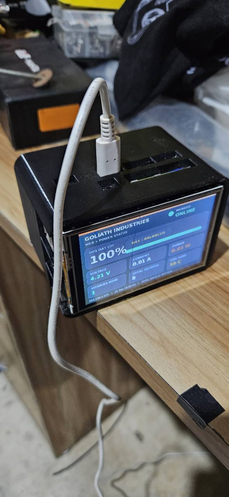
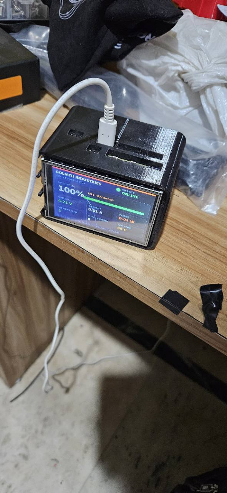
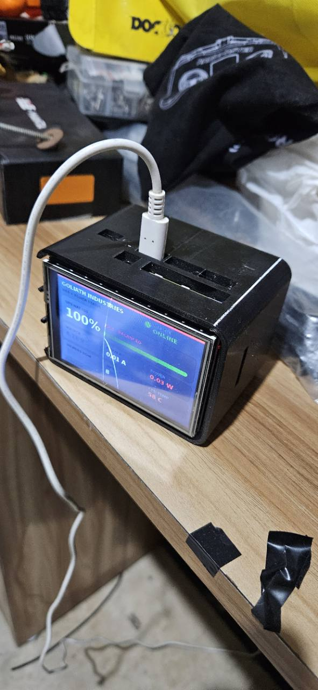
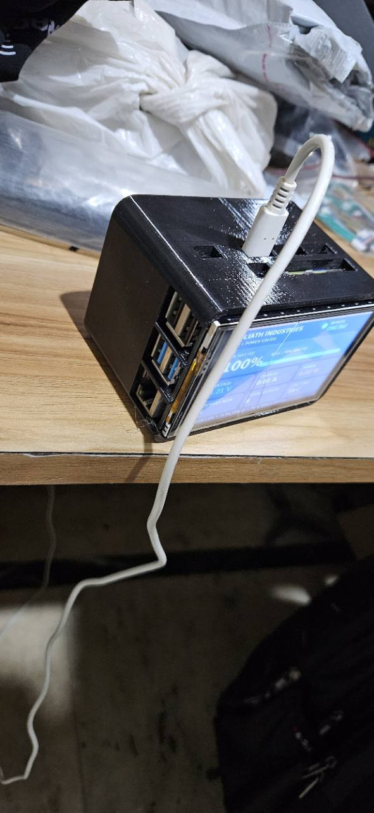
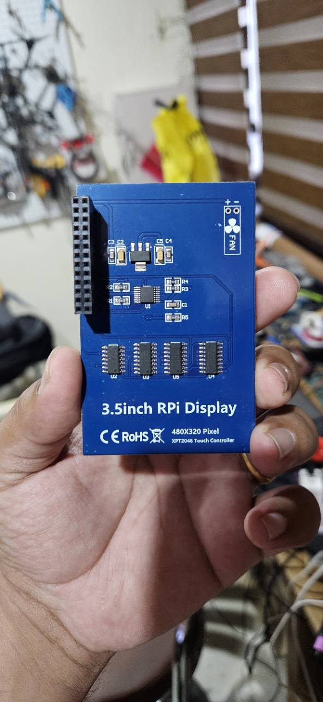

# Webhosting Deck

Own your server. See its health at a glance. Keep your site online when the power is not.

Webhosting Deck turns a Raspberry Pi into a compact, UPS-backed web appliance with a dedicated 3.5-inch status display. It runs a static website behind Nginx, publishes it safely through a Cloudflare Tunnel, and shows power, temperature, network, website and visitor information without installing a desktop environment.



> [!IMPORTANT]
> This is a reference build, not a preconfigured image. Every hostname, domain and address in the instructions is a placeholder. Never commit tunnel credentials, passwords, private keys or real visitor IP addresses.

## What it does

- Hosts a static website on a Raspberry Pi
- Uses Cloudflare Tunnel, so no inbound router port needs to be opened
- Boots into a lightweight framebuffer dashboard instead of a desktop
- Reads voltage, current and power from a Waveshare UPS HAT (D)
- Shows website health, CPU temperature, local address and privacy-preserving visitor counts
- Survives short power cuts when correctly powered through the UPS HAT
- Starts every component automatically with `systemd`

## Reference hardware

- Raspberry Pi 4 Model B (1 GB is sufficient for a static site)
- Raspberry Pi OS Lite, 64-bit
- Waveshare UPS HAT (D), detected at I²C addresses `0x43` and `0x2d`
- Generic 3.5-inch 480×320 SPI display using ILI9486 and XPT2046
- Suitable batteries and a regulated USB power supply approved for the UPS board
- microSD card, enclosure and optional cooling fan

Other Pi models and displays can work, but overlays, framebuffer paths and power budgets may differ.

## Architecture

```text
Visitors
   │ HTTPS
Cloudflare edge
   │ outbound encrypted tunnel
cloudflared ──► Nginx on 127.0.0.1:8080 ──► static website
                    │ access log
                    ▼
             status dashboard ──► /dev/fb0
                    │
                    ├── INA219 on I²C (UPS telemetry)
                    ├── CPU thermal sensor
                    └── local health check
```

## Quick start

1. Assemble the hardware following [Hardware and power](docs/hardware.md).
2. Flash Raspberry Pi OS Lite and complete the base setup in [Installation](docs/installation.md).
3. Clone this repository on the Pi.
4. Copy and edit the example configuration:

   ```bash
   cp config/dashboard.example.json config/dashboard.json
   nano config/dashboard.json
   ```

5. Run the installer:

   ```bash
   sudo bash scripts/install.sh
   ```

6. Put your static site in `/var/www/webhosting-deck/`.
7. Configure the public hostname using [Cloudflare Tunnel](docs/cloudflare-tunnel.md).
8. Reboot and review [Verification and troubleshooting](docs/troubleshooting.md).

## Gallery

| Front | Three-quarter view |
|---|---|
|  |  |

| Ports | Display module |
|---|---|
|  |  |

The photographs are included as a live example of one completed build. Your enclosure, screen orientation and cable routing may differ.

## Documentation

- [Hardware and power](docs/hardware.md)
- [Installation](docs/installation.md)
- [Cloudflare Tunnel](docs/cloudflare-tunnel.md)
- [Dashboard configuration](docs/dashboard.md)
- [Power cuts, recovery and backups](docs/resilience.md)
- [Verification and troubleshooting](docs/troubleshooting.md)
- [Security and privacy](SECURITY.md)

## Design principles

1. **No public inbound ports.** The tunnel originates from the Pi.
2. **No full desktop.** The status panel writes directly to the framebuffer.
3. **No secrets in source control.** Credentials live outside the repository.
4. **No raw visitor IP retention.** The dashboard stores keyed hashes only.
5. **Failure should be visible.** Services restart automatically and the screen shows local health.

## Limitations

- A UPS does not replace tested backups.
- A single Pi is still a single point of failure.
- The example viewer count is approximate; it is not a full analytics platform.
- Some UPS HAT (D) revisions report current with reversed polarity. This is configurable.
- Many inexpensive SPI displays have a hard-wired backlight and cannot be dimmed in software.

## License

Code and documentation are released under the [MIT License](LICENSE). The included build photographs remain subject to their creator's rights and are provided here as project documentation.
